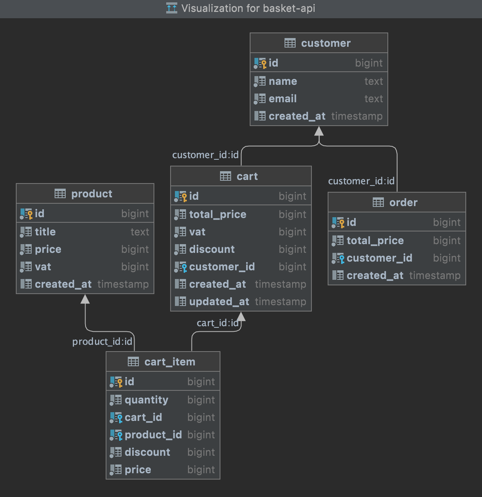

# basket-api
The basket service is a REST API developed in Go.

<div align="center"> </div>


Customers will be able to purchase existing products. Product creation, update, deletion or user creation etc for the admin use cases are not yet developed. 
You can import the necessary data to run the customer usecase scenarios to the database from the csv files under the data folder.

You can find the detailed documentation of the project under the docs.

----
## Getting Started

### Installing Required Packages
    . postgres
    . golang-migrate
    . mockery
    . sqlc

Install packages

`$ brew install golang-migrate postgres mockery sqlc`
OR

Run `scripts/bootstrap.sh`

### Installing Postgres

1. Install and run Postgresql
    1. if you use Mac, you can follow this steps :
       [Mac Setup PostgreSQL](https://sourabhbajaj.com/mac-setup/PostgreSQL/)
2. Create database that named basket_api
   >createdb basket_api
3. Run migrations from Makefile
   > make migrateup
    1. You can see the details of golang-migrate: [DB migration in Go](https://medium.com/geekculture/db-migration-in-go-lang-d325effc55de)
   

4. All tables are ready! Now, go to [data](https://github.com/damla-unal/basket-api/tree/main/data) folder
    1. import `product.csv` to product table
    2. import `customer.csv` to customer table
    3. import `cart.csv` to cart table
   
---

**There are several ways to implement CRUD operations on database in golang.**

 

You can read [this blog](https://dev.to/techschoolguru/generate-crud-golang-code-from-sql-and-compare-db-sql-gorm-sqlx-sqlc-560j) comparing these options.
As a result of these comparisons, I decided to use the `sqlc` package. sqlc will generate idiomatic Golang codes, which uses the standard database/sql library.
You can [sqlc github page](https://github.com/kyleconroy/sqlc) for the details.


### RUN

---
To run application you need:
- .config.yml

#### Configuration File

To run basket-api locally you should create own .config.yml in the root directory.
For this, you can copy the `.config_default.yml` and rename to `.config.yml`.

Example `.config.yml` :

```
postgres:
   url: postgresql://localhost:5432/basket_api?sslmode=disable

http_server:
   port: 8080

threshold_for_discount:
   amount: 10000
```

You can set your postgresql url and http_server.port.

`threshold_for_discount`, variable is the amount used to calculate whether the customer qualifies for the discounts.

All the following items must be completed to run the application:
 - [x] Installed required packages
 - [x] Created db (`make createdb`)
 - [x] Ran migrations (`make migrateup`)
 - [x] Imported csv file to db tables(product, customer, cart)
 - [x] Created own `.config.yml`

If these items are OK, basket-api will be ready at the port given in the configuration with this command :

       $ go run basket-api server

---

### Project Structure
` /cmd` : 
Main applications for this project. By taking the application configs from the configuration file, a new server is started and created a new db Pool.

`/data` : Contains csv files to be imported into the database.

`/db`: Migration files and query files are located here. Sqlc looks in the migration folder here to create schemas and generates code by running the files under the query folder.

`/docs` : Design and user documents

`/internal` : Actual application code is located here
   

   --------`/api`: in here, a router is created using [gin](https://github.com/gin-gonic/gin), a web framework.

   --------`/dpsql`: the codes generated by `sqlc` are located here.

   --------`/model`: our domain data and request/response dtos.

   --------`/persistence`: database operations are performed here. There are DAO files.

   --------`/route`: http handlers are in here

   --------`/service`: contains some business logic for each model

   --------`/util`: contains helpers and discount functions

`/mocks` : mock files created by Mockery are located here.

`/scripts` : to perform various build, and install

----

## Diagram


----


## Testing

Unit tests use [Mockery](https://github.com/vektra/mockery) to create mocks. Mockery provides the ability to easily generate mocks for golang interfaces
Mockery generates mocks and stores them in the mocks directory which is committed to source control.

When adding a method to an interface that is mocked in tests you will need to run Mockery so that the mock file is updated.

You can run all test with this command :

         $ go test ./...

-----


